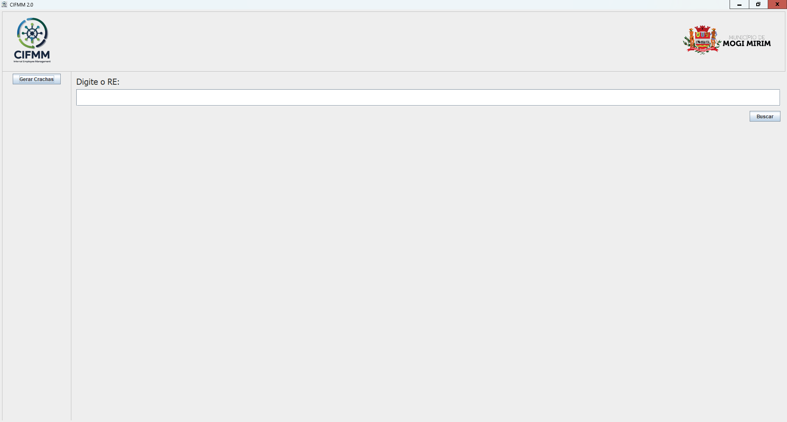

<!-- Banner do projeto -->

  

<h1 align="center">CIFMM 2.0.0</h1>

Sistema de gerenciamento de funcionários

---

## 📌 Índice
- [Sobre o Projeto](#-sobre-o-projeto)
- [Tecnologias](#-tecnologias)
  
---

## 💡 Sobre o Projeto

O Projeto CIFMM foi desenvolvido para gerenciar e armazenar dados dos funcionários.

---

## 🛠 Tecnologias
Este projeto foi desenvolvido com as seguintes tecnologias:

- ⚡ [Java]
- 🖼️ [Swing]
- 📄 [PDFBox]
- 🌐 Outras libs/frameworks: Spring Boot,Commons-IO,Spring Boot JPA,Selenium WebDriver,WebDriverManager,Jsoup,SQLite,Hibernate.

